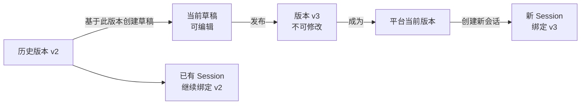
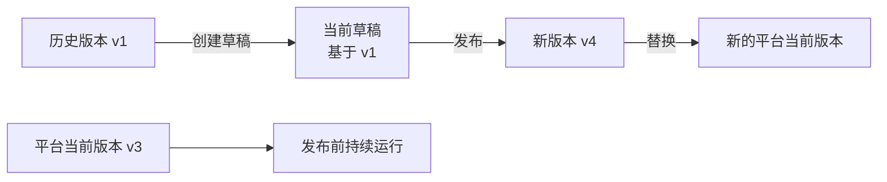

# AgentHub 草稿、版本与会话关系及测试指南

> 适用范围：AgentHub 单平台当前版本管理方案
> 目标读者：产品、前端、后端、测试与实施人员
> 更新时间：2026-07-21

## 1. 文档目的

本文用于统一 AgentHub 中“当前草稿”“已发布版本”“平台当前版本”“Client”和“Session 会话”的产品与技术含义，并提供可以直接执行的测试用例。

核心原则：

> 草稿是正在编辑的工作副本；版本是发布后冻结的不可变快照；会话在创建时绑定当时的平台当前版本。

## 2. 核心对象

| 对象 | 数量与生命周期 | 是否可修改 | 对运行请求的影响 |
| --- | --- | --- | --- |
| 当前草稿 | 每个 Agent 最多一个当前草稿 | 可以编辑和保存 | 保存后不直接影响线上运行 |
| 已发布版本 | 可以有多个，例如 v1、v2、v3 | 不可修改 | 可以被平台设为当前版本，也可以继续服务已绑定会话 |
| 平台当前版本 | 已发布版本中唯一一个 | 只能通过发布新草稿替换 | 新会话和无 Session 请求默认使用它 |
| Client | 跟随 Agent 的平台当前版本 | 不允许独立选择 Agent 版本 | 同步平台当前版本，为新会话提供运行入口 |
| Session 会话 | 用户创建的持续对话上下文 | 会话内容可继续追加 | 创建时绑定一个版本，发布后不自动迁移 |

## 3. 总体关系



关系说明：

1. 编辑、保存和测试只作用于当前草稿。
2. 发布草稿会生成新的不可变版本，并将它设置为唯一平台当前版本。
3. 新 Session 使用发布后的平台当前版本。
4. 已有 Session 继续使用创建时绑定的历史版本。
5. 历史版本只能用于查看、导出或创建新草稿，不能被直接修改。

## 4. 草稿与版本的关系

### 4.1 关键字段

| 字段 | 含义 |
| --- | --- |
| `current_version_id` | 当前线上运行的已发布版本 ID |
| `draft_base_version_id` | 当前草稿最初基于哪个已发布版本创建 |
| `draft_revision` | 草稿修订号，用于并发保存与发布校验 |
| `draft_content_hash` | 当前草稿内容摘要 |
| `version_hash` | 已发布版本内容的不可变摘要 |

### 4.2 保存草稿

保存草稿时：

- 更新 Agent 的可编辑内容；
- `draft_revision` 增加；
- 不生成新版本；
- 不改变 `current_version_id`；
- 不改变已有 Session 的版本绑定；
- 新 Session 仍使用原平台当前版本。

“当前无草稿”在产品界面中应理解为“当前没有未发布差异”，不代表后端完全不存在可编辑的 Agent 草稿对象。

### 4.3 发布草稿

发布草稿时：

1. 后端校验 `expected_draft_revision`；
2. 后端校验 `expected_current_version_id`；
3. 后端校验 Client 能力兼容性；
4. 发布成功后生成新的版本号和 Version Hash；
5. 新版本成为唯一平台当前版本；
6. 原平台当前版本进入历史版本列表；
7. 已有 Session 的绑定保持不变。

### 4.4 基于历史版本创建草稿

假设：

```text
平台当前版本：v3
选择的历史版本：v1
```

基于 v1 创建草稿后：

```text
当前草稿：基于 v1
平台运行：仍为 v3
新 Session：仍绑定 v3
已有 Session：保持原绑定
```

如果随后发布该草稿，应生成 v4，而不是覆盖 v1，也不是把版本号回退到 v1。



## 5. 版本与会话的关系

### 5.1 标准流转示例

初始状态：平台当前版本为 v1。

1. 用户 A 创建 Session A，Session A 绑定 v1。
2. Creator 修改并保存草稿，Session A 仍使用 v1。
3. Creator 发布草稿，平台当前版本变为 v2。
4. Session A 继续使用 v1。
5. 用户 B 创建 Session B，Session B 绑定 v2。
6. 无 Session ID 的请求默认使用 v2。

最终关系：

| 请求或会话 | 使用版本 |
| --- | --- |
| 发布前创建的 Session A | v1 |
| 发布后创建的 Session B | v2 |
| 无 Session ID 的请求 | 平台当前版本 v2 |
| 草稿测试 | 当前草稿，不改变正式版本绑定 |

### 5.2 为什么已有会话不自动升级

Session 可能已经积累了上下文、记忆、工具调用结果和角色关系。如果发布新版本后强制切换，可能导致：

- 角色人格在对话中途变化；
- 系统提示词前后不一致；
- 技能或工具突然增加、减少；
- 记忆解释方式发生变化；
- 同一会话的结果难以复现和审计。

因此已有 Session 必须继续使用创建时绑定的版本。

## 6. Client 与版本、会话的关系

Client 不独立选择 Agent 版本，而是跟随平台当前版本。

```text
Agent 平台当前版本 → Client 跟随或同步 → 新 Session 绑定
```

不是：

```text
Client A 自选 v1
Client B 自选 v2
Client C 自选 v3
```

规则如下：

- Client 同步状态表示它是否已经确认平台当前版本；
- Client 离线不等于不兼容；
- Client 显式缺少必需能力时，发布可以被阻止；
- 发布新版本后，Client 为新 Session 使用新版本；
- Client 不会强制迁移已有 Session；
- 不关联 Client 也可以导出平台当前版本的通用 ZIP 包。

## 7. 必须保持的系统不变量

以下规则适合作为产品验收和自动化测试的断言：

1. 每个 Agent 同一时刻最多只有一个平台当前版本。
2. 已发布版本不可被编辑或覆盖。
3. 保存草稿不会生成新版本。
4. 测试草稿不会生成新版本。
5. 基于历史版本创建草稿不会改变平台当前版本。
6. 发布成功后才能更新平台当前版本。
7. 发布失败时平台当前版本必须保持不变。
8. 发布新版本不会修改已有 Session 的版本绑定。
9. 新 Session 和无 Session 请求使用平台当前版本。
10. 相同发布请求重复提交不能生成两个版本。
11. 草稿并发冲突不能静默覆盖他人的修改。
12. 历史版本的 Version Hash、配置和资源清单在发布后保持不变。

## 8. 功能验收用例

### TC-01 首次发布

**前置条件**

- Agent 已有初始草稿；
- `current_version_id` 为空；
- 版本历史为空。

**操作步骤**

1. 进入版本页；
2. 确认页面显示首次发布状态；
3. 发布当前草稿。

**预期结果**

- 生成 v1；
- v1 具有唯一 `version_hash`；
- v1 成为平台当前版本；
- 版本历史只包含 v1；
- 新 Session 使用 v1；
- 发布人显示名称，不显示纯数字用户 ID。

### TC-02 保存草稿不影响线上

**前置条件**

- 平台当前版本为 v1。

**操作步骤**

1. 修改角色系统提示词；
2. 点击“保存草稿”；
3. 创建一个新的正式 Session。

**预期结果**

- `draft_revision` 增加；
- 页面显示存在未发布修改；
- 平台当前版本仍为 v1；
- 不生成 v2；
- 新的正式 Session 仍使用 v1；
- 已有 Session 不受影响。

### TC-03 测试草稿不影响线上

**操作步骤**

1. 修改并保存草稿；
2. 点击“测试草稿”；
3. 不执行发布。

**预期结果**

- 测试链路使用草稿配置；
- 平台当前版本不变；
- 不生成新版本；
- 不改变任何正式 Session 的版本绑定。

### TC-04 发布新版本

**前置条件**

- 平台当前版本为 v1；
- 当前草稿存在未发布修改；
- 已有 Session A 绑定 v1。

**操作步骤**

1. 发布当前草稿；
2. 创建 Session B；
3. 分别继续向 Session A 和 Session B 发送消息。

**预期结果**

- 生成 v2；
- v2 成为平台当前版本；
- v1 成为历史版本；
- Session A 继续使用 v1；
- Session B 使用 v2；
- 无 Session 请求使用 v2。

### TC-05 基于历史版本创建草稿

**前置条件**

- 平台当前版本为 v3；
- 历史中存在 v1。

**操作步骤**

1. 在版本历史中选择 v1；
2. 点击“基于此版本创建草稿”；
3. 返回构建页。

**预期结果**

- 构建页显示“当前草稿 · 基于 v1”；
- 构建页继续显示“平台运行 v3”；
- 不生成新版本；
- 新 Session 仍使用 v3；
- 发布该草稿后生成 v4。

### TC-06 替换已有未发布草稿

**前置条件**

- 当前草稿存在未发布修改。

**操作步骤**

1. 选择一个历史版本创建草稿；
2. 在后端返回 `DRAFT_HAS_UNPUBLISHED_CHANGES` 后查看提示；
3. 取消替换；
4. 再次操作并确认替换。

**预期结果**

- 第一次请求不覆盖现有草稿；
- 页面明确提示会替换未发布修改；
- 取消后原草稿保留；
- 确认后才替换草稿；
- 平台当前版本始终不变。

### TC-07 草稿并发保存冲突

**操作步骤**

1. 页面 A 和页面 B 同时打开同一 Agent；
2. 页面 A 修改并保存；
3. 页面 B 使用旧 `draft_revision` 保存。

**预期结果**

- 页面 B 收到 `DRAFT_CONFLICT`；
- 页面 B 不静默覆盖页面 A 的修改；
- 页面 B 刷新最新草稿；
- 页面提示用户检查后重新编辑和保存。

### TC-08 发布时草稿冲突

**操作步骤**

1. 页面 A 打开发布弹窗；
2. 页面 B 修改并保存草稿；
3. 页面 A 使用旧 Revision 发布。

**预期结果**

- 发布接口返回 `DRAFT_CONFLICT`；
- 平台当前版本不变；
- 页面显示明确、可操作的错误提示；
- 刷新最新草稿后才能再次发布。

### TC-09 当前版本并发变化

**操作步骤**

1. 页面 A 和页面 B 同时打开发布弹窗；
2. 页面 A 发布成功；
3. 页面 B 仍使用旧 `expected_current_version_id` 发布。

**预期结果**

- 页面 B 收到 `CURRENT_VERSION_CHANGED`；
- 不重复生成版本；
- 页面 B 刷新版本历史和 Agent 状态；
- 用户需要重新检查后发布。

### TC-10 发布幂等

**操作步骤**

1. 发起一次发布；
2. 模拟网络超时或响应丢失；
3. 使用相同 `request_key` 重试相同发布请求。

**预期结果**

- 不生成两个版本；
- 版本号只增加一次；
- 后端返回同一次发布结果；
- 草稿发生变化或重新发起发布动作后使用新的 `request_key`。

### TC-11 Client 兼容性

**场景 A：Client 离线但兼容**

- 发布不应仅因离线而被阻止。

**场景 B：Client 明确缺少能力**

- 后端返回 `CLIENT_INCOMPATIBLE`；
- 发布不执行；
- 平台当前版本保持不变；
- 页面指出需要处理的 Client 或能力问题。

### TC-12 已发布版本不可变

**操作步骤**

1. 发布 v2；
2. 记录 v2 的 Version Hash、配置、技能和媒体摘要；
3. 修改并保存新草稿；
4. 再次查看 v2。

**预期结果**

- v2 的 Version Hash 不变；
- v2 的配置和资源快照不变；
- 修改仅存在于当前草稿中。

### TC-13 通用版本导出

**前置条件**

- Agent 已有平台当前版本；
- Agent 可以没有关联 Client。

**操作步骤**

1. 进入发行页；
2. 点击“导出当前版本”；
3. 确认导出。

**预期结果**

- 无 Client 时导出按钮仍可使用；
- 前端调用 Agent 级导出接口；
- 下载后端生成的 ZIP；
- ZIP 固定为导出时的平台当前版本；
- 后续发布新版本不会自动修改已导出的 ZIP。

## 9. 建议的端到端验证数据

建议准备一个专用测试 Agent，并在不同版本中放置明显标识：

| 版本 | 系统提示词标识 | 技能标识 | 用途 |
| --- | --- | --- | --- |
| v1 | 回复末尾添加 `[VERSION_V1]` | 无 | 验证旧会话绑定 |
| v2 | 回复末尾添加 `[VERSION_V2]` | 图片生成 | 验证新会话与技能版本 |
| v3 | 回复末尾添加 `[VERSION_V3]` | 图片生成、天气 | 验证连续发布 |

测试时：

1. 在 v1 创建 Session A；
2. 发布 v2；
3. 在 v2 创建 Session B；
4. 同时向 A、B 发送相同问题；
5. A 应继续出现 `[VERSION_V1]`；
6. B 应出现 `[VERSION_V2]`。

该方式可以在会话接口尚未直接返回版本绑定字段时，辅助验证版本固定行为。

## 10. 当前可观测性缺口与建议

当前前端 `RuntimeSession` 类型没有显式声明以下字段：

```json
{
  "agent_version_id": 35,
  "agent_version_no": 2,
  "agent_version_hash": "cca50c91ef1f..."
}
```

如果后端 Session 查询也没有返回这些信息，前端和测试只能通过行为差异间接判断会话绑定版本，不利于排错、审计和自动化验收。

建议：

1. Session 创建和详情接口返回绑定版本 ID、版本号和 Hash；
2. 应用运营的会话详情展示“绑定版本”；
3. 会话列表支持按 Agent 版本筛选；
4. 测试评估结果记录测试使用的是草稿还是已发布版本；
5. 发布审计日志记录旧当前版本、新当前版本和发布请求 key。

## 11. 测试结果记录模板

| 用例 | 环境 | Agent | 操作前当前版本 | 操作后当前版本 | 草稿基础版本 | Session 绑定 | 结果 | 证据 |
| --- | --- | --- | --- | --- | --- | --- | --- | --- |
| TC-01 | 测试环境 |  | 无 | v1 | 初始草稿 | 新会话 v1 | 通过/失败 | 截图/响应 |
| TC-04 | 测试环境 |  | v1 | v2 | v1 | A=v1、B=v2 | 通过/失败 | 截图/响应 |
| TC-05 | 测试环境 |  | v3 | v3 | v1 | 新会话 v3 | 通过/失败 | 截图/响应 |

## 12. 相关规格

- `openspec/changes/agent-single-current-version-management/specs/agent-version-lifecycle/spec.md`
- `openspec/changes/agent-single-current-version-management/specs/agent-client-version-following/spec.md`
- `openspec/changes/agent-single-current-version-management/design.md`
