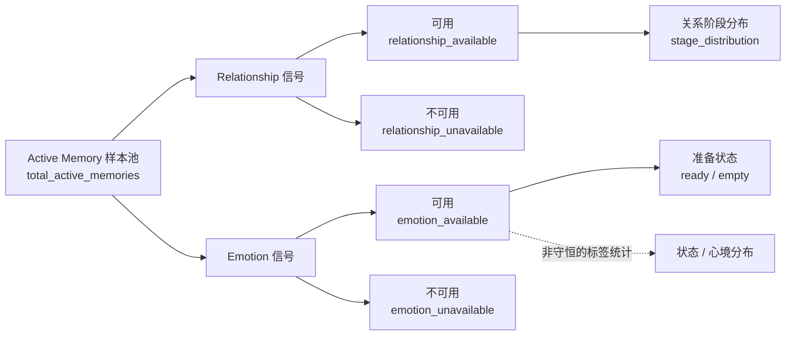

# AgentHub × AgentMem 创作者运营管理功能方案

> 文档状态：按 2026-07-31 更新后的 Creator API 重新设计
> 版本：v1.0
> 适用范围：仅使用 `linkyun-agent/docs/AGENTMEM_AGENT_API.md` 已公开的现有接口
> 产品原则：一份 Memory 对应一个 Agent × 用户关系；创作者只能看 Agent 级匿名聚合，用户只能看自己的单份 Memory

## 1. 结论

现有接口可以上线一版创作者侧的 **Memory 运营观测台**，但它是只读的健康观测与体验信号诊断，
不是事实内容管理台，也不是用户关系管理台。

Creator 侧的产品主轴应当是：

1. 当前 Agent 有多少 active Memory。
2. Relationship 与 Emotion 信号的服务覆盖是否完整。
3. 已覆盖样本处于什么阶段、状态和心境分布。
4. 哪一类数据缺失，创作者当前应该等待、刷新还是排查集成。

关系强度和情绪均值只作为匿名的辅助体验信号，不作为核心经营指标，也不展示任何单个用户或
单份 Memory。

用户侧另设“我与 Agent”页面，只使用当前用户自己的 Memory Insights。两类页面不得混用。

## 2. 当前接口能做什么

### 2.1 Creator 侧唯一数据源

```http
GET /api/v1/agents/{agent_id}/memory-analytics
```

接口返回一个 Agent 的匿名聚合快照：

| 数据域 | 直接字段 | 可支持的功能 |
| --- | --- | --- |
| 样本规模 | `coverage.total_active_memories` | active Memory 总数 |
| Relationship 覆盖 | `relationship_available`、`relationship_unavailable` | 覆盖率、缺失量、完整性状态 |
| Emotion 覆盖 | `emotion_available`、`emotion_unavailable` | 覆盖率、缺失量、完整性状态 |
| 关系阶段 | `relationship.stage_distribution` | 阶段分布与占比 |
| 关系聚合 | 三项 average、`milestone_count`、`score_scales` | 匿名总体信号 |
| 情绪准备度 | `emotion.status_distribution` | `ready` / `empty` 分布 |
| 当前状态 | `emotion.state_distribution` | 状态出现次数与覆盖占比 |
| 心境 | `emotion.mood_distribution` | 心境分布 |
| 情绪聚合 | means、`sample_count`、relationship level、recent affection | 匿名总体信号 |
| 完整性 | `partial` | 部分成功提示 |

接口没有时间、Agent 版本、Client、用户、Memory 或分页参数，所以当前页面只能展示 **Agent 当前
快照**。

### 2.2 用户侧数据源

```http
GET /api/v1/user/agents/{agent_id}/memory-insights
```

它只返回当前认证用户自己的：

- 关系阶段和阶段标签。
- affection、trust、familiarity。
- 里程碑数量。
- 当前状态、并存状态和心境。
- valence、arousal、样本数、长期关系信号和近期亲密表达。
- `partial` / `unavailable`。

该接口不接受目标 `user_id`，因此不能用于 Creator 查看或筛选其他用户。

### 2.3 现有 Creator 接口不能支持

- 单份 Memory 列表、节点或详情。
- 用户身份、用户画像、关系星图或用户下钻。
- 事实数量、事实类型、事实内容、重复、冲突和 supersede 链。
- 召回次数、命中率、空召回率、query 延迟和 fallback。
- 写入任务成功率、耗时、重试、task result 和成本。
- 历史趋势、环比、时间筛选、Agent 版本或 Client 筛选。
- 修改、导入、删除事实或整库抹除。
- 证明 Memory 改善回复、留存或收入。

AgentMem 上游虽然已有 facts CRUD、import 和 erase，但当前文档只把它们定义为 LinkYun 后端内部
能力，没有 Creator 管理路由，前端不能据此设计可点击的管理动作。

## 3. 产品定位与信息架构

AgentHub 中建议放置：

```text
Agent 详情
└── 运营
    └── Memory
        ├── 概览
        ├── 信号覆盖图谱
        ├── 体验信号
        └── 数据说明
```

页面名称使用“Memory 运营”，首屏标题使用“Memory 信号健康”。避免使用“记忆质量”“记忆效果”
或“用户关系管理”，因为现有接口无法证明这些结论。

当前 P0 是只读页面。“管理”体现为发现状态、解释原因和给出下一步建议，不包含对 Memory 内容的
增删改。

## 4. 首屏结构

### 4.1 页头

```text
Memory 信号健康
Agent 选择器｜当前快照｜自动刷新开关｜刷新
```

- 默认 60 秒刷新一次，符合接口建议的 30–60 秒区间。
- 服务端归一化信号缓存为 45 秒；45 秒内手动刷新时提示“数据可能仍来自当前缓存”。
- 不提供日期、版本、Client 或用户筛选器。
- 页面只显示“本次获取时间”，不能称为“数据更新时间”，因为接口未返回数据生成时间。

### 4.2 核心指标

首屏只保留四个可解释指标：

| 指标 | 计算 | 展示要求 |
| --- | --- | --- |
| active Memory | `total_active_memories` | 直接计数 |
| Relationship 覆盖 | `relationship_available / total_active_memories` | 同时展示 `可用数 / 总数` |
| Emotion 覆盖 | `emotion_available / total_active_memories` | 同时展示 `可用数 / 总数` |
| Emotion 样本 | `emotion.sample_count` | Emotion 整段缺失时显示 `—`，不能显示 0 |

当 `total_active_memories=0` 时，两项覆盖率显示“暂无样本”，不计算为 0%。

### 4.3 页面主次

```text
第一屏：核心指标 + 信号覆盖图谱 + 当前诊断
第二屏：关系阶段分布 + 情绪准备度
第三屏：状态/心境分布 + 聚合分数
页尾：口径、量纲、隐私和数据限制
```

## 5. 主图：Memory 信号覆盖图谱

图谱不画用户节点，也不画单份 Memory。它表达的是一个匿名样本池经过两类信号服务后形成的
聚合结果。



### 5.1 节点与连线

| 图形元素 | 字段 | 规则 |
| --- | --- | --- |
| 中心节点 | `total_active_memories` | 显示本次聚合的匿名样本池 |
| Relationship 可用/不可用 | 两个 coverage 字段 | 连线宽度按数量占比分配 |
| Emotion 可用/不可用 | 两个 coverage 字段 | 连线宽度按数量占比分配 |
| 关系阶段节点 | `stage_distribution` | 只在 Relationship 可用分支内计算占比 |
| Emotion ready/empty | `status_distribution` | 只在 Emotion 可用分支内计算占比 |
| 状态与心境 | 两类 distribution | 使用并列条形或标签，不使用守恒型桑基流 |

`state_distribution` 统计每份 Memory 的并存状态，同一 Memory 可贡献多个不同状态，所以状态计数
总和可能大于 `emotion_available`。该分支不能被画成总量守恒的流量图。

### 5.2 交互

- 悬停节点：显示数量、分母、占比和口径。
- 点击 Relationship 或 Emotion 分支：滚动到对应分析区，不打开用户或 Memory 明细。
- 点击“不可用”：展开当前诊断说明，只显示匿名总数。
- 图谱不提供搜索、单节点下钻或用户导出。

## 6. 分析模块

### 6.1 Relationship 阶段分布

图表：横向条形图。

```text
阶段名称｜Memory 数｜占 Relationship 可用样本比例
```

计算：

```text
stage_share = stage_count / relationship_available
```

如果所有阶段计数之和与 `relationship_available` 不一致，页面保留原始数值并显示“上游阶段口径
待确认”，不能在前端补齐未知阶段。

### 6.2 Emotion 准备度

图表：`ready` 与 `empty` 的双段条形图。

```text
ready_rate = status_distribution.ready / emotion_available
empty_rate = status_distribution.empty / emotion_available
```

解释：

- `ready`：已经形成可用的 Emotion 样本。
- `empty`：Emotion 服务可访问，但尚未形成样本。
- `emotion_unavailable`：服务信号未取得，不属于 `empty`。

三者必须严格区分，避免把服务失败解释成用户没有情绪。

### 6.3 状态与心境分布

- `state_distribution` 使用水平条形图，展示“覆盖 Memory 数 / Emotion 可用数”。
- 一个 Memory 可以拥有多个状态，因此各状态覆盖率之和可以超过 100%。
- `mood_distribution` 使用排序条形图，展示匿名的心境标签分布。
- 小样本不做用户画像结论，只显示“当前样本中的信号分布”。

### 6.4 聚合分数

次级卡片展示：

- average affection。
- average trust。
- average familiarity。
- milestone 总数。
- mean valence。
- mean arousal。
- relationship level。
- recent affection。

展示规则：

1. 所有数值必须同时读取对应模块的 `score_scales`。
2. 不同量纲之间不横向比较，不统一强制映射成百分制。
3. `null` 显示 `—` 和“暂无可计算样本”，不能当作 0。
4. Relationship 均值的分母是 `relationship_available`。
5. Emotion 均值由服务端按 `sample_count` 加权，页面必须同时显示总样本数。
6. 不使用红/绿表达好坏；这些值是体验信号，不是健康、价值或付费评分。

### 6.5 前端可安全派生的指标

| 派生指标 | 公式 | 使用位置 |
| --- | --- | --- |
| Relationship 覆盖率 | `relationship_available / total_active_memories` | KPI、图谱 |
| Emotion 覆盖率 | `emotion_available / total_active_memories` | KPI、图谱 |
| 阶段占比 | `stage_count / relationship_available` | 阶段分布 |
| Emotion ready 率 | `ready / emotion_available` | 准备度 |
| 平均 Emotion 样本数 | `sample_count / emotion_available` | 数据说明 |
| 状态覆盖率 | `state_count / emotion_available` | 状态分布 |

所有除法在分母为 0 时返回“暂无样本”，不能返回 0%。

## 7. 当前诊断与运营建议

P0 不虚构“问题队列”。只根据本次响应生成确定性的状态说明：

| 条件 | 状态 | 页面文案 | 建议动作 |
| --- | --- | --- | --- |
| `total_active_memories=0` | 暂无样本 | 尚未形成 active Memory | 先完成真实用户互动，再回来查看 |
| `partial=false` 且两类覆盖完整 | 数据完整 | 本次聚合信号完整 | 无需处理 |
| `relationship_unavailable>0` | 部分可用 | 有 N 份 Relationship 信号暂不可用 | 60 秒后刷新；持续出现时排查服务 |
| `emotion_unavailable>0` | 部分可用 | 有 N 份 Emotion 信号暂不可用 | 60 秒后刷新；持续出现时排查服务 |
| `relationship_available=0` 且总数大于 0 | 模块不可用 | 当前没有可展示的 Relationship 聚合 | 隐藏分数，保留覆盖诊断 |
| `emotion_available=0` 且总数大于 0 | 模块不可用 | 当前没有可展示的 Emotion 聚合 | 隐藏分数，保留覆盖诊断 |
| `emotion.empty>0` | 样本形成中 | N 份可访问 Memory 尚无 Emotion 样本 | 继续积累互动，不视为服务故障 |
| Emotion 聚合数值为 `null` | 暂不可计算 | 当前样本不足以计算该指标 | 展示 `—`，不做异常告警 |

当前接口没有历史数据，不能判断“持续出现”。P0 只能提示用户稍后刷新；若要形成持续性告警，
必须新增服务端快照或监控事件。

不设置低覆盖率、低 affection 或负 valence 的红色阈值。没有基线和业务验证前，这些阈值会产生
错误的质量判断。

## 8. 页面状态与错误处理

### 8.1 HTTP 200

- `partial=false`：正常展示。
- `partial=true`：保留已取得数据，在页头和对应模块显示覆盖提示。
- Relationship 或 Emotion 整段省略：模块显示“暂不可用”，不渲染零值。
- `total_active_memories=0`：展示引导型空状态，不渲染空图表。

### 8.2 HTTP 错误

| HTTP / 错误码 | 页面行为 |
| --- | --- |
| 400 | 提示 Agent 参数异常，不重试 |
| 401 | 进入重新鉴权流程 |
| 404 `AGENTMEM_ANALYTICS_NOT_FOUND` | 统一显示“Agent 不存在或无查看权限” |
| 503 `AGENTMEM_ANALYTICS_UNAVAILABLE` | 隐藏运营内容，显示“Memory 分析服务暂未配置” |
| 500 | 保留上次成功快照并明确标记为旧数据；没有旧数据时显示重试 |

接口当前未返回稳定的快照时间。若前端保留上次成功响应，只能标注“上次获取于 HH:mm:ss”，不能
暗示这是上游数据更新时间。

## 9. P0 可用操作

现有接口下只提供以下低风险操作：

- 切换 Creator 自己拥有的 Agent。
- 手动刷新。
- 开关 60 秒自动刷新。
- 展开指标口径和 `score_scales`。
- 下载当前匿名聚合快照为 JSON 或 CSV；文件不得包含用户或 Memory 标识。
- 复制当前诊断摘要，用于内部排障。

不展示以下按钮：

- 查看用户。
- 查看 Memory。
- 编辑事实。
- 导入历史。
- 删除事实或清空 Memory。
- 调整召回策略。
- 调整 AgentMem 模式。

这些能力没有当前 Creator API 合同，出现按钮会制造无法履约的管理预期。

## 10. 用户侧“我与 Agent”

用户侧使用 `/api/v1/user/agents/{agent_id}/memory-insights`，页面名称建议为“我与 Agent”或
“我们的记忆”。

可展示：

- 当前关系阶段。
- affection、trust、familiarity 和里程碑数。
- 当前状态、并存状态和心境。
- Emotion 样本量和聚合信号。
- 数据部分不可用提示。

不能展示：

- 关系或情绪时间线，因为接口只有当前快照。
- Memory ID、binding、Key 或消息正文。
- 其他用户选择器或排行榜。

当用户无注册账号、无 active binding 或尚未形成关系时，404 统一展示“互动后会逐步形成你和
Agent 的记忆”，不暴露底层绑定状态。

## 11. 隐私约束

Creator 页面必须保持匿名聚合：

- 不展示或缓存 `binding_uuid`、`memory_id`、Memory 名称。
- 不展示用户 ID、用户名、联系方式或聊天正文。
- 不从分布、样本数或小样本组合反推单个用户。
- 不把 Relationship / Emotion 用于医疗、心理诊断、信用、授权或其他高风险决策。
- 导出内容与屏幕内容保持相同聚合粒度。

当 `total_active_memories` 很小，现有 API 仍可能让 Creator 从业务上下文猜测样本归属。P0 页面
不增加任何交叉筛选或组合下钻，以免进一步放大重识别风险。

## 12. P0 验收标准

1. 页面只请求 `GET /agents/{agent_id}/memory-analytics`。
2. 页面没有用户、Memory、时间、版本或 Client 筛选。
3. `partial=true` 时仍展示可用模块，缺失模块不显示为 0。
4. active Memory 为 0 时不计算覆盖率。
5. 所有 `null` 均显示为暂无数据。
6. 所有分数按 `score_scales` 解释，不跨量纲比较。
7. `state_distribution` 不被画成守恒流量。
8. Emotion `empty` 与 `unavailable` 有不同文案和视觉。
9. 自动刷新间隔不短于 30 秒，建议 60 秒。
10. 页面不出现任何单个用户或单份 Memory 信号。
11. 页面不声称展示记忆质量、业务效果或历史趋势。
12. 所有下载和复制内容都保持 Agent 级匿名聚合。

## 13. 后续要变成真正“运营管理”所缺的接口

这部分不是 P0 页面能力，只记录缺口。

| 管理目标 | 至少需要新增的 Creator 聚合合同 |
| --- | --- |
| 记忆内容质量 | facts 数量、类型、强化、supersede、匿名问题计数 |
| 召回运行健康 | query 数、命中、空召回、延迟、超时、fallback |
| 写入运行健康 | add/task 数、状态、耗时、重试、稳定错误码、task result |
| 变化趋势 | 按日快照或运营事件流 |
| 版本归因 | Agent version / Client 维度的匿名聚合 |
| 内容治理 | 服务端授权的事实审阅、修正、删除和审计接口 |

在这些合同出现前，Creator 的最佳产品不是“关系图谱”或“事实图谱”，而是本方案中的
**信号覆盖图谱 + 当前诊断**。
