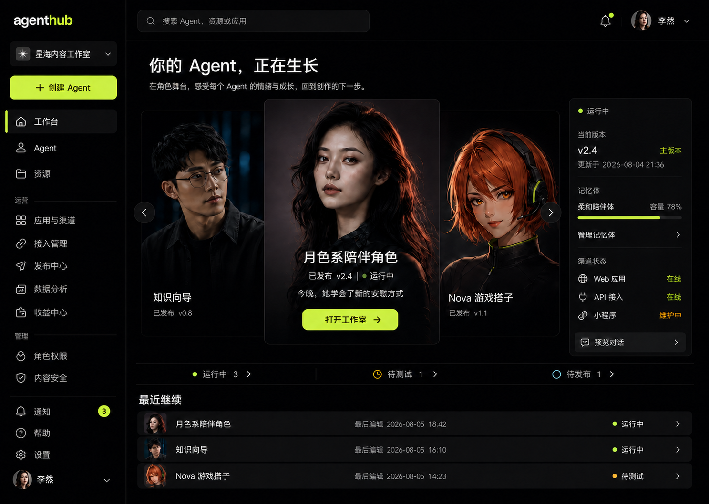
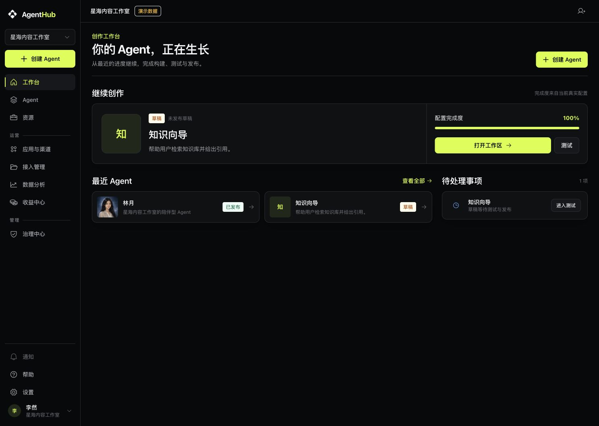
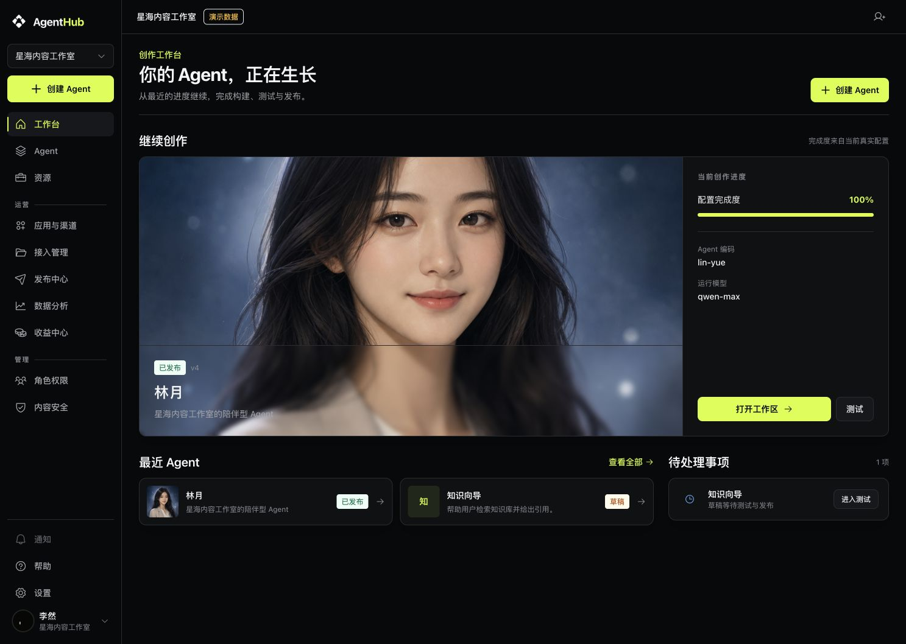
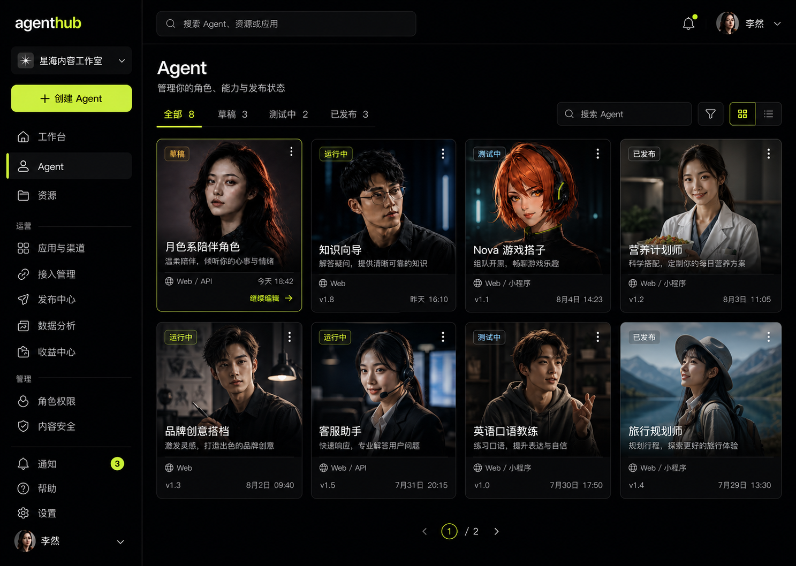
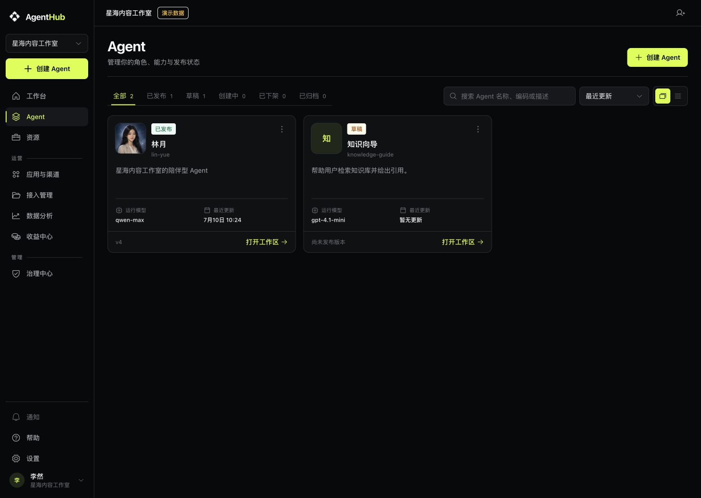
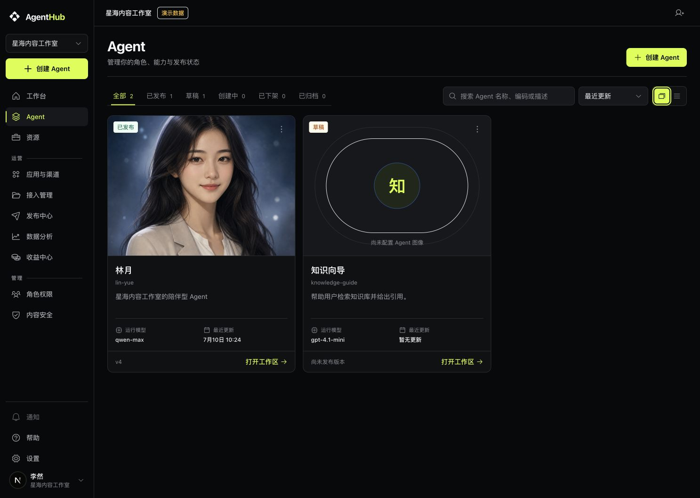

# 执行任务完成汇报

- 任务 ID：LYN-004-R1
- 目标项目：`agenthub`
- 当前状态：待 LYN-004-Q 独立复验
- 固定起点：`7b36f26647aaec6cd5945ba2367b4876a45cb8f5` / tree `83a449772c246e7772de692fd144416ca15a53cf`
- 分支：`task/lyn-004-r1-qa-fixes_2026-08-05`
- 数据边界：隔离 `NEXT_PUBLIC_AGENTHUB_DATA_MODE=demo`，仅用于 UI 与交互证据

## 结论

Q-001～Q-004 已逐项修正并通过本地自动门禁与浏览器自查；本次未新增后端 API、DTO、数据模型、权限语义、创建流程或伪造业务数据，P0/P1 自查为 0，等待同一 LYN-004-Q 独立复验。

## 实际变更或产物

- 导航：增加“发布中心”“角色权限”“内容安全”独立入口；发布中心通过现有 Agent 查询进入既有 Agent distribution 路由；治理使用 `/governance/roles|safety` 的真实 tab 状态。
- 工作台：主创作区域改为现有 Agent 图像主导，同时保留继续创作、最近 Agent、待处理事项、完成度、构建与测试入口。
- Agent 资产：卡片改为 4:3 大图主导，保留字段、整卡链接、列表模式、视图记忆、搜索、筛选和排序；无图显示明确占位。
- 对比度：`--color-text-muted` 从 `#6f737a` 调整为 `#898d94`，增加按 WCAG 相对亮度公式计算的多 surface 自动断言。
- QA 图像：`docs/qa/images/lyn-004-r1-*.png`；批准参考副本：`docs/qa/design-reference/lyn-004-r1-*.png`。

## 完成标准核对

1. Q-001 导航信息架构
   - 结果：PASS。
   - 修正前：独立 QA 报告确认仅有合并后的“治理中心”，且缺全局“发布中心”。
   - 修正后：`/distribution`、`/assets/32/distribution` 的全局 active 均唯一为“发布中心”；`/governance/roles` 与 `/governance/safety` 各自只有一个全局 active 和一个匹配的 selected tab。导航测试覆盖 18 个路由/约束场景，发布选择页测试确认只使用 `useAgents()` 和既有 distribution 路由。
2. Q-002 工作台图像层级
   - 结果：PASS。
   - 修正前后：见下方 1487×1058 成对证据。主视觉使用现有 Agent `config.metadata.avatar` 或后端头像 URL；无图不生成替代资产。
3. Q-003 Agent 卡片图像层级
   - 结果：PASS。
   - 修正前后：见下方 1487×1058 成对证据。浏览器实测卡片约 `400×547px`，图像为 4:3 主区域；真实图与“尚未配置 Agent 图像”占位同时验证。
   - 行为回归：列表搜索“知识向导”收敛为 1 行；自动测试继续覆盖默认卡片、视图记忆、搜索筛选排序及 guided-create 链接。
4. Q-004 普通小字号对比度
   - 结果：PASS。
   - 修正前：`#6f737a` 对 canvas 为 4.18:1。
   - 修正后：运行时 `#898d94` 对 canvas 5.98:1、surface 5.68:1、elevated 5.34:1、primary-soft 4.61:1；均不低于 4.5:1。disabled 控件的降透明度属于 WCAG 例外，装饰性边框不承担文字含义。

## 1487×1058 成对比较

### 工作台

| 批准设计 | 修正前 | 修正后 |
| --- | --- | --- |
|  |  |  |

### Agent 卡片

| 批准设计 | 修正前 | 修正后 |
| --- | --- | --- |
|  |  |  |

## 验证结果

- 构建：`npm run build` PASS，生成 19 个静态页面，新增 `/distribution` 与动态 `/governance/[area]` 路由成功。
- 测试：`npm run test` PASS，75 files / 353 tests。
- 静态检查：`npm run lint` PASS；`npm run typecheck` PASS；`openspec validate --all --strict` PASS（29/29）；`git diff --check` PASS。
- 浏览器视口：`/workbench`、`/assets`、`/distribution`、`/governance/roles`、`/governance/safety` 在 1440、1280、640 CSS px（1280@200% 等效）均满足 root/body 横向溢出为 0。
- 键盘与动效：交互链接焦点环实测 `2px solid rgb(215, 255, 47)`；浏览器 CSSOM 确认 reduced-motion 将动画/过渡压缩到 `0.01ms`。
- Console：0 error / 0 warning。

## 信息分类

- 已确认：四项 P1 均有源码、自动测试和浏览器证据；截图仅含隔离 Demo Agent，未包含 Key、账号、Prompt、真实用户或生产数据。
- 假设：沿用独立 QA 口径，以 640 CSS px 表示 1280px 浏览器 200% 缩放的等效布局。
- 待决策：无；独立 QA 可直接按原 LYN-004-Q 矩阵复验。

## 风险与回滚

- 已知风险：V1 仍为 UI-only；真实后端连通、生产权限和真实发布副作用不在本次验证范围。
- 未覆盖范围：Q-005 P2、Living World、V2 AI 创建、真实治理、真实发布、部署与生产环境。
- 回滚或恢复方式：本次为单一任务分支上的本地提交，可按提交整体 revert；无数据迁移。

## 阻塞

- 阻塞事项：无。
- 需要谁处理：LYN-004-Q 独立 QA 复验。

## 建议下一步

- 以本任务最终 commit/tree 作为新固定候选，复跑原 LYN-004-Q 全矩阵；不要从 Demo 结论外推真实后端或生产权限。
