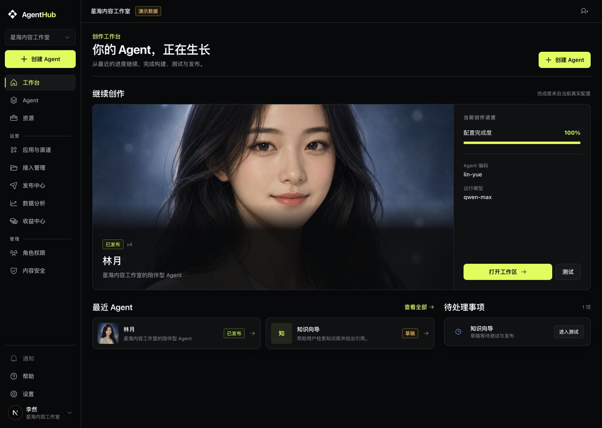
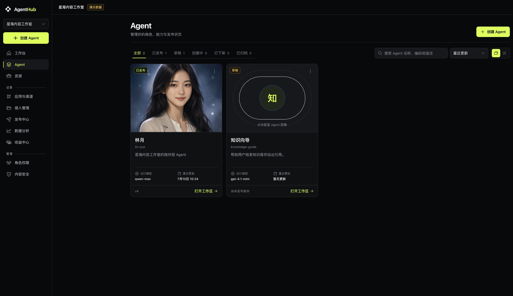

# LYN-004-R8 修前视觉与交互审计

- 审计日期：2026-08-06
- 实现基线：`e22e329a0709d247dcc2742147ea47becea92a6c`
- 数据状态：`NEXT_PUBLIC_AGENTHUB_DATA_MODE=demo`，仅使用仓库既有脱敏 fixture
- 捕获工具：Codex 内置 Browser（IAB）
- 视觉真值：
  - 工作台：`/Users/king/Projects/linkyun/linkyun-control/deliverables/LYN-004-agenthub-v1-ui-designs/22-workbench-reference-final.png`（1487×1058）
  - Agent 页：`/Users/king/Projects/linkyun/linkyun-control/deliverables/LYN-004-agenthub-v1-ui-designs/23-agent-library-reference-final.png`（2254×1590）

## 审计范围与用户目标

审计覆盖 `/workbench` 与 `/assets` 的修前默认卡片态。用户目标是快速识别当前 Agent、继续最近工作，并在 Agent 资产中按状态、关键词和排序进行浏览。截图能够确认视觉层级、响应式占位与可见交互，但不能单独证明完整键盘顺序、读屏语义或所有动态状态；这些项目需要在修后 Browser 回归中继续验证。

## 编号步骤与页面

### 1. 工作台默认态（1487×1058）

健康度：可用但与视觉真值的信息架构存在明显偏差。

已确认优点：真实 Agent 图片、名称、状态、版本、模型和配置完成度均来自现有字段；打开工作区、测试、查看全部和最近 Agent 链路清晰；两条既有 Agent 数据在缺少更多记录时没有被伪造补齐。

差异与风险：

- **P1-W1｜缺少多 Agent 舞台/选择器。** 当前是一张横向大图加右侧进度卡，邻位 Agent 不可在主舞台直接切换；参考图以中央当前 Agent、左右邻位和切换按钮建立“多 Agent 正在成长”的核心认知。修复：从真实 `agents` 建立可轮换舞台；少于 3 个时只渲染存在的邻位并保持中心层级。
- **P1-W2｜状态汇总与最近继续层级缺失。** 当前下半区是“最近 Agent + 待处理事项”，缺少参考图中位于舞台下方的真实生命周期数量汇总，也没有紧凑的“最近继续”行式记录。修复：从 `resolveAgentLifecycle` 和真实时间字段派生汇总及最近列表，不新增通知、渠道、收益或假时间。
- **P1-W3｜主舞台比例和焦点不匹配。** 当前图像横向铺满、人物脸部被放大裁切，中心 Agent 缺少独立卡片轮廓；参考图的中心卡更高、更窄且相邻角色仍可见。修复：使用现有图片的 `cover` 舞台卡并保持当前 Agent 独立边框、底部渐隐文案与主 CTA。
- **P2-W4｜右侧详情缺少状态/版本语义的完整组合。** 当前只显示完成度、编码和模型；参考图右侧详情强调生命周期、版本和当前数据。修复：仅在真实字段存在时补状态、版本、更新时间、编码、模型；无依据字段明确省略。
- **P2-W5｜页面首屏纵向节奏偏松。** 顶部标题、二级“继续创作”和大型 hero 占用较多高度，下方最近项在首屏的可扫描性弱于参考图。修复：压缩标题与段落间距，将舞台、汇总和最近继续组织为连续结构。
- **P2-W6｜可访问性可见风险。** 舞台没有可见的 Agent 切换控件，因此也无对应键盘焦点目标；部分次级文字对比度较低。修复：新增具名按钮、`aria-pressed`/当前项语义和明显 `focus-visible`，保留共享语义色 token；最终对比度仍需浏览器/自动工具复核。

### 2. Agent 资产默认卡片态（2254×1590）

健康度：核心发现与导航能力完整，但视觉密度和卡片信息结构未达到选定参考。

已确认优点：状态 tabs/count、搜索、排序、卡片/列表切换和菜单均存在；整卡导航与缺图诚实占位可见；只有两个真实 fixture 时页面没有伪造更多 Agent。

差异与风险：

- **P1-A1｜宽屏网格密度不足。** 2254px 视口只有两张窄卡靠左，占用不足半行；参考图在相同视口为四列紧凑资产网格。修复：将内容区域改为宽屏四列、1440 至少三列、1280 可用密度、720 单列的明确响应式网格。
- **P1-A2｜卡片不是图像主导结构。** 当前图片只占卡片上部，名称/编码/描述在独立正文区，导致卡片接近传统管理卡；参考图在图片底部渐隐层承载名称和描述。修复：卡片上部合并图片与渐隐 identity overlay，状态左上、菜单右上，下部仅保留真实元数据。
- **P1-A3｜卡片高度过高且随断点变化。** 当前宽屏单卡约 536px 高，只有两项时显得稀疏；参考卡固定、紧凑，可在首屏显示两行。修复：使用固定且一致的卡片高度与稳定的图片/元数据分区，长文案 line-clamp，缺字段不改变卡高。
- **P2-A4｜筛选工具条与标题分离过远。** 顶部 header、tabs、搜索/排序形成三段松散布局，右侧工具与结果起点不齐。修复：保留既有控件与状态语义，压缩为参考图式标题/状态 tabs + 同行发现工具，并确保窄屏自然换行。
- **P2-A5｜元数据层级过重且展示设计稿未要求的编码。** 当前正文强调 Agent code、运行模型和更新时间，并另设大 footer；参考图只在图片下部保留紧凑真实元数据。修复：图片 overlay 不再突出 code；下部仅显示有依据的模型/版本/更新时间等现有字段，缺失时使用诚实中性文案或省略。
- **P2-A6｜卡片操作焦点可能被整卡覆盖层弱化。** 当前整卡绝对定位链接与独立菜单叠加；可见默认态无法确认菜单、链接和视图切换的键盘顺序。修复：继续保持菜单高于整卡链接，补充清晰的卡片 `focus-within`/链接焦点样式，并在修后 Browser 中验证菜单与整卡导航不互相触发。
- **P2-A7｜大列表与空白空间风险。** 当前无分页但宽屏大量空白；更多 Agent 时网格高度与扫描节奏未得到同视口证据。修复：通过 fixture 的既有记录和组件/模型测试覆盖大列表映射，不新增示例 Agent；浏览器验收覆盖缺图、长文案、筛选空态、加载和错误结构。

## 优先级汇总

- P0：0
- P1：6（W1–W3、A1–A3）
- P2：7（W4–W6、A4–A7）

所有 P1/P2 均已映射到本轮实现或修后验证项。设计 QA 只有在同视口 source + after 组合对比中确认 P0/P1/P2 清零后才可通过。
